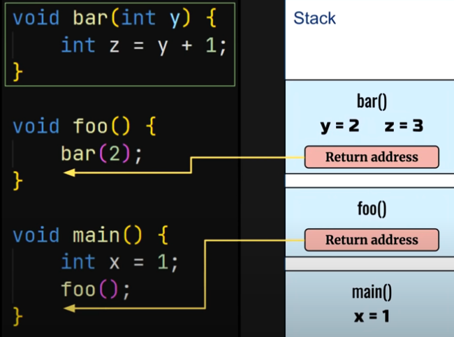
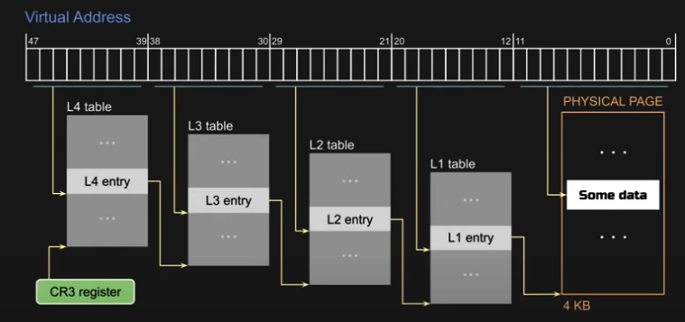

# Write Your Own 64-bit Operating System Kernel #2 - Stack, long mode and printing using C code

https://www.youtube.com/watch?v=wz9CZBeXR6U&list=PLZQftyCk7_SeZRitx5MjBKzTtvk0pHMtp&index=2&ab_channel=CodePulsR


1. Create Stack for C code
2. Switch to 64-bit
3. C code

## Stack


```
  mov esp, stack_top


  ...
  section .bss
  stack_bottm:
    resb 4096 * 4
  stack_top:
```

CPU use esp register (Stack Pointer) to determine the address of the current stack frame

## 64-bits


## Paging
map virtual address to physical address


